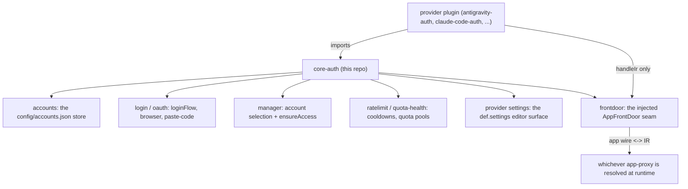

The provider library every account-backed plugin builds on. It owns everything a
provider needs that is not its own upstream wire format: the account store, the
OAuth and in-browser login flows, the shared provider settings surface,
rate-limit and quota bookkeeping, and the front-door seam that lets a provider
stay `handleIr`-only.
Published as `@intisy-ai/core-auth`, which every provider resolves as a dependency
from its home's shared library store rather than inlining a copy: the library is left
external in a provider's bundle and materialised once per home.

## Under-the-Hood Architecture



The front-door is deliberately injected rather than imported: core-auth stays
app-agnostic, so it never names an app or an app-proxy. A provider implements
`handleIr(IrRequest, ctx)` and never sees the app's wire format.

## Structure

- `src/accounts.ts`, `src/live-store.ts` — the account store and the live `Store`
  threaded through `HandlerCtx` (never construct a second one)
- `src/login.ts`, `src/oauth.ts`, `src/oauth-login.ts`, `src/browser.ts` — the
  unified login flow, including paste-a-redirect-URL for container use
- `src/manager.ts`, `src/controller.ts` — account selection and `ensureAccess`
- `src/ratelimit.ts`, `src/quota-health.ts`, `src/leaderboard.ts` — cooldowns,
  quota pools, and per-provider quota reporting
- `src/provider.ts`, `src/provider-common.ts`, `src/provider-plugin.ts` — the
  provider definition surface and its plugin runtime
- `src/frontdoor.ts` — the injected `AppFrontDoor` seam (names no app)
- `src/errors.ts` — the typed `HandleIrError` the front-door duck-types by `name`
- `java/` — the TeaVM single-source Java side, built by `npm run build:teavm`
- `dist/` — compiled output (generated; not committed)

## Installation

```bash
npm install @intisy-ai/core-auth
```

## Configuration

core-auth reads its own settings from `config/auth.json` in the active app's
config dir, and keeps accounts in `config/accounts.json`. No config file is
created until a value is actually set.

## Logging

Logs are tagged `[core-auth]` and written to
`<configDir>/logs/YYYY-MM-DD/core-auth-HH-MM-SS.log`. Console mirroring follows
the ecosystem-wide `logConsole` setting in `config/settings.json`.
